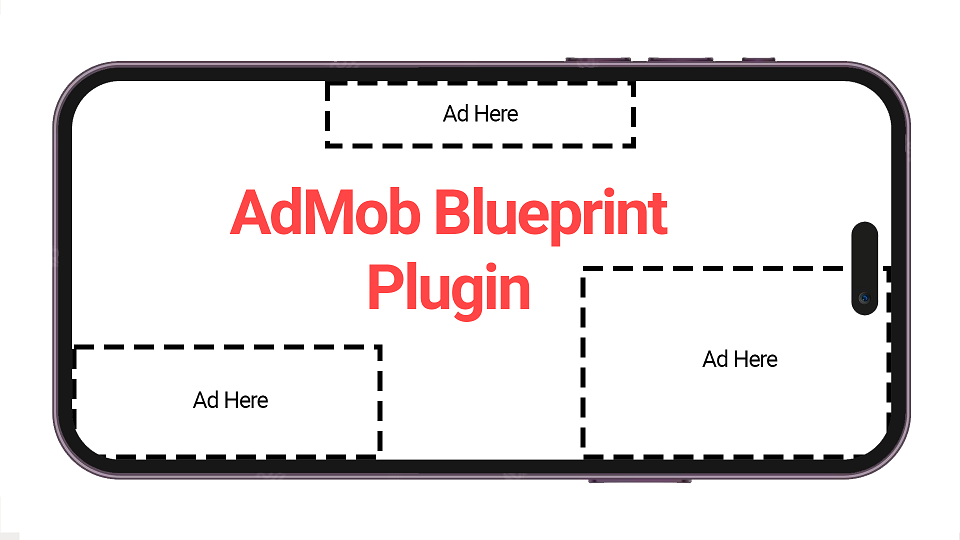

# Google Admob Blueprint

 

Easily add Google AdMob Ads to your Android and iOS app on Unreal Engine 4.27, 5.0,and 5.1.

Can develop on Windows and Mac and package to Android and iOS.

- Banner Ads
- Interstitial Ads

Get the [plugin here](https://www.unrealengine.com/marketplace/en-US/product/admob-blueprint) in the Unreal Engine Marketplace.

 

Setup and also (w/ Test Ads):

https://codeible.com/view/videotutorial/8k92mQRVWseK67IjfOMg

Banner Ad tutorial:

https://codeible.com/view/videotutorial/8k92mQRVWseK67IjfOMg;title=Adding%20a%20Banner%20Ad

Interstitial Ads tutorial:

https://codeible.com/view/videotutorial/8k92mQRVWseK67IjfOMg;title=Interstitial%20Ads

Reward Ads tutorial:

https://codeible.com/view/videotutorial/8k92mQRVWseK67IjfOMg;title=Rewarded%20Ads

Package your project:

https://codeible.com/view/videotutorial/8k92mQRVWseK67IjfOMg;title=Packaging%20the%20Google%20AdMob%20Blueprint%20Plugin